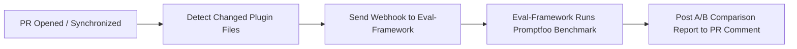

# Demo Claude Code Marketplace

> A sample repository for the **Claude Code Plugin Marketplace** featuring custom plugins, sub-agents, skills, slash commands, and an automated **AI Evaluation CI/CD Pipeline**.

---

## 📁 Repository Structure

```text
demo-claude-marketplace/
├── .claude-plugin/
│   └── marketplace.json            # Main configuration file for the Marketplace Catalog
├── .github/
│   └── workflows/
│       └── trigger-promptfoo-eval.yaml # CI/CD workflow triggering AI evaluation on PRs
├── plugins/                        # Contains all custom plugins
│   ├── cpp-code-review/            # Plugin 1: C++ Code Review & Audit
│   │   ├── .claude-plugin/
│   │   │   └── plugin.json         # Manifest for the cpp-code-review plugin
│   │   ├── commands/               # Custom Slash Commands (e.g. /review-cpp)
│   │   │   └── review-cpp.md
│   │   ├── agents/                 # Custom Sub-Agents (e.g. cpp-auditor)
│   │   │   └── cpp-auditor.md
│   │   ├── skills/                 # Skill guidelines for Claude Code
│   │   │   └── cpp-best-practices/
│   │   │       └── SKILL.md
│   │   └── README.md
│   ├── git-workflow/               # Plugin 2: Git Workflow Automation
│   │   ├── .claude-plugin/
│   │   │   └── plugin.json         # Manifest for the git-workflow plugin
│   │   ├── commands/
│   │   │   └── conventional-commit.md
│   │   ├── skills/
│   │   │   └── git-standards/
│   │   │       └── SKILL.md
│   │   └── README.md
│   ├── answer-formatter/           # Plugin 3: Response Formatting & Writing Style
│   │   ├── .claude-plugin/
│   │   │   └── plugin.json         # Manifest for the answer-formatter plugin
│   │   ├── commands/
│   │   │   └── format-response.md
│   │   ├── skills/
│   │   │   └── response-formatting/
│   │   │       └── SKILL.md
│   │   └── README.md
│   └── doc-review/                 # Plugin 4: Technical Document Review & Auditing (PRD, API Specs)
│       ├── .claude-plugin/
│       │   └── plugin.json         # Manifest for the doc-review plugin
│       ├── commands/
│       │   ├── review-doc.md
│       │   ├── audit-api-doc.md
│       │   └── doc-lint.md
│       ├── agents/
│       │   └── doc-auditor.md
│       ├── skills/
│       │   └── doc-review-standards/
│       │       └── SKILL.md
│       └── README.md
├── testcases/                      # Promptfoo benchmark testcases & fixtures
│   ├── fixtures/                   # Sample documents (poor PRDs, architecture specs)
│   └── reviewi-doc-testcases.yaml  # Testcase assertions and rubric scoring rules
└── README.md
```

---

## 🚀 Usage Guide for Claude Code CLI

### 1. Add This Marketplace to Claude Code

Register this marketplace in Claude Code using the following command (specify the local directory path or GitHub URL):

- **Local Path:**
  ```bash
  /plugin marketplace add d:/Workspace/test/demo-claude-marketplace
  ```

- **Remote GitHub URL:**
  ```bash
  /plugin marketplace add https://github.com/trungbb7/demo-claude-marketplace
  ```

### 2. Install Plugins from the Marketplace

Once the marketplace is added, install plugins by marketplace name:

```bash
/plugin install cpp-code-review@demo-claude-marketplace
/plugin install git-workflow@demo-claude-marketplace
/plugin install answer-formatter@demo-claude-marketplace
/plugin install doc-review@demo-claude-marketplace
```

### 3. Available Features

- **Slash Commands:**
  - `/review-cpp`: Review C++ code against modern C++20 standards, memory safety, and best practices.
  - `/conventional-commit`: Automatically inspects `git diff --staged` and suggests standardized Conventional Commits.
  - `/format-response`: Switch response styles dynamically (`concise`, `executive`, `architect`, `tutor`, `code-first`).
  - `/review-doc`: Comprehensive document quality audit (PRD, Tech Spec, Architecture, README) with a Quality Score (0-100).
  - `/audit-api-doc`: In-depth API documentation audit (OpenAPI, REST API reference, endpoints, schemas, status codes).
  - `/doc-lint`: Markdown format linter (heading hierarchy, broken links, image alt text, code blocks).

- **Sub-Agents:**
  - `cpp-auditor`: Specialized auditor for memory safety, concurrency, and performance in C++ codebases.
  - `doc-auditor`: Specialized auditor for detecting ambiguities, missing non-functional requirements (NFRs), and architectural gaps.

---

## 🤖 Automated AI Evaluation Pipeline (CI/CD)

This repository features an integrated **Automated AI Benchmark & Regression Testing** workflow via GitHub Actions and [Eval-Framework](file:///d:/Workspace/test/Eval-Framework/README.md).



### How It Works:
1. **Trigger**: When a developer opens or updates a Pull Request modifying files inside `plugins/`, the workflow `.github/workflows/trigger-promptfoo-eval.yaml` is triggered.
2. **Change Detection**: The action filters changed files via `git diff` and packages them into a JSON payload containing the commit SHA, branch, repo, and changed file paths.
3. **Webhook Dispatch**: Sends an HTTP POST request to the **Eval-Framework** runner VM (`PROMPTFOO_VM_WEBHOOK_URL`).
4. **Immediate Acknowledgment**: The server returns `202 Accepted` immediately, and the action posts an initial "Evaluation In Progress" status comment on the PR.
5. **A/B Benchmark Execution**: The runner clones both the PR commit and the `main` baseline branch in an isolated sandbox, executing dual-provider Promptfoo evaluations via Claude Agent SDK and Claude Sonnet as the judge.
6. **PR Reporting**: Once evaluation concludes, the bot publishes a comprehensive comparison report (Scores, Pass/Fail, Latency, Cost, Rubrics) as a comment on the Pull Request.

### GitHub Secrets Configuration:
To enable automated evaluations on your repository, configure the following secret under **Repository Settings > Secrets and variables > Actions**:
- `PROMPTFOO_VM_WEBHOOK_URL`: The webhook URL of your Eval-Framework server (e.g., `https://your-eval-server.domain/api/eval-webhook`).

---

## 📝 Adding a New Plugin to the Marketplace

1. **Create a new plugin directory inside `plugins/`:**
   ```bash
   mkdir -p plugins/my-new-plugin/.claude-plugin
   ```
2. **Create `plugin.json` at `plugins/my-new-plugin/.claude-plugin/plugin.json`:**
   ```json
   {
     "name": "my-new-plugin",
     "version": "1.0.0",
     "description": "Your plugin description",
     "author": { "name": "Your Name" }
   }
   ```
3. **Add plugin components (commands, skills, agents, hooks):**
   - Commands: `plugins/my-new-plugin/commands/my-command.md`
   - Skills: `plugins/my-new-plugin/skills/my-skill/SKILL.md`
   - Agents: `plugins/my-new-plugin/agents/my-agent.md`
4. **Register the new plugin in `.claude-plugin/marketplace.json`:**
   ```json
   {
     "name": "my-new-plugin",
     "source": "./plugins/my-new-plugin",
     "description": "Short description of your plugin",
     "version": "1.0.0"
   }
   ```

---

## 📌 Important Rules & Best Practices

- The `plugin.json` file **must** reside at `.claude-plugin/plugin.json` inside each plugin directory.
- The `marketplace.json` file **must** reside at `.claude-plugin/marketplace.json` at the repository root.
- Plugin components such as `commands/`, `skills/`, `agents/`, and `hooks/` must be placed at the root of the plugin directory (not inside `.claude-plugin/`).
- Whenever modifying prompt instructions, slash commands, or agent behaviors, ensure corresponding evaluation testcases are added or updated in `testcases/` or within the matching suite in `Eval-Framework`.
